<div align="center">

# Horilla HR Mobile

**The open-source HR app for your whole team: clock in, apply for leave, approve requests and keep up with the company, from your phone.**

[](https://github.com/horilla/horilla-hr-mobile/actions/workflows/ci.yml)
[](https://flutter.dev)
[](#getting-started)
[](LICENSE)

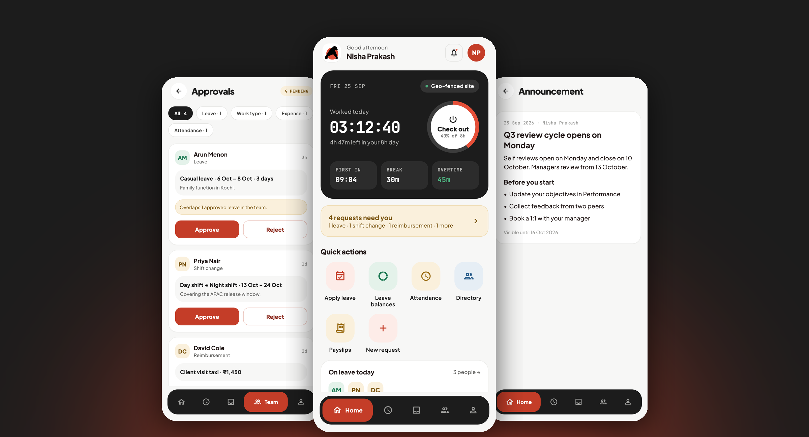

</div>

Horilla HR Mobile is the companion app for [Horilla HR](https://github.com/horilla/horilla-hr), a free and open-source HRMS. It connects to **your own Horilla server**, self-hosted or cloud, and puts the everyday parts of HR in your pocket. The whole app adapts to who signs in: employees see their own day, and managers also get an approvals inbox and a live view of their team.

## Features

**For everyone**

- **One-tap punch in and out**, with geofencing when your company uses it, and an optional face-presence check before a punch.
- **A live workday**: hours worked today, breaks and overtime, and a monthly hour account.
- **Leave**: balances at a glance, a calendar-based apply flow that shows holidays, allocation requests, and the status of every request.
- **Attendance corrections** for a missed or wrong punch, sent to your manager for approval.
- **Requests**: shift and work-type changes, assets and expense claims.
- **Payslips**: every month, with earnings and deductions broken down.
- **Announcements**: the full company feed with an unread marker; opening one marks it read.
- **Notifications and a people directory.**
- **Biometric unlock**: Face ID or fingerprint to reopen the app.

**For managers**

- **Approvals inbox**: leave, allocations, shift and work-type changes, attendance fixes and expenses in one queue, with a clash warning when a leave overlaps others in the team. Approve or reject in one tap, with a few seconds to undo.
- **My team**: who has checked in, who is on leave, and which days this week the team is stretched thin.

## Screenshots

<table>
  <tr>
    <td align="center">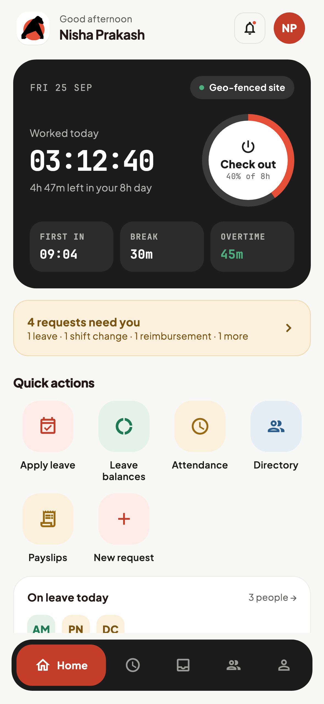<br><sub><b>Home</b></sub></td>
    <td align="center">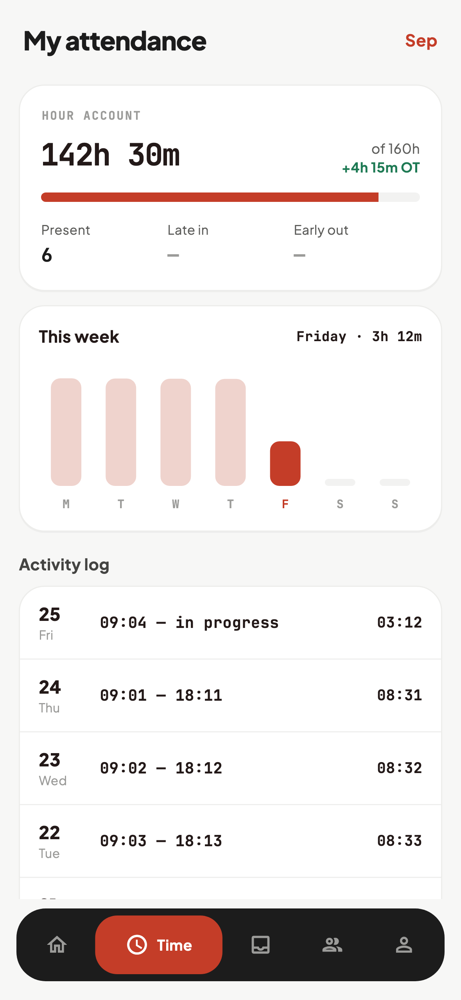<br><sub><b>Attendance</b></sub></td>
    <td align="center">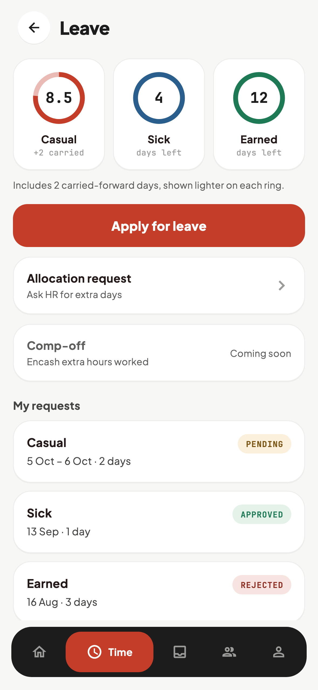<br><sub><b>Leave</b></sub></td>
    <td align="center">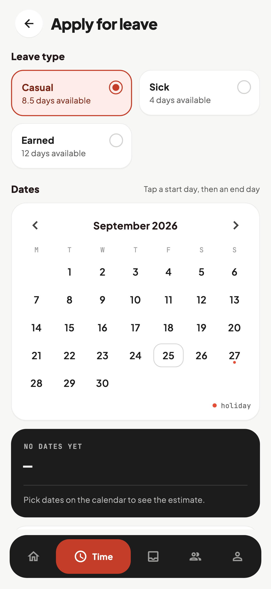<br><sub><b>Apply for leave</b></sub></td>
  </tr>
  <tr>
    <td align="center">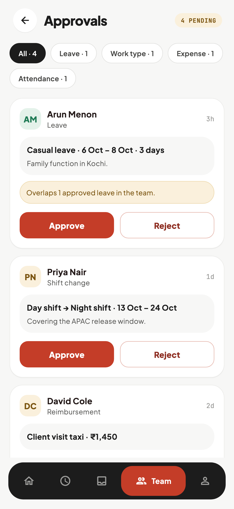<br><sub><b>Approvals</b></sub></td>
    <td align="center">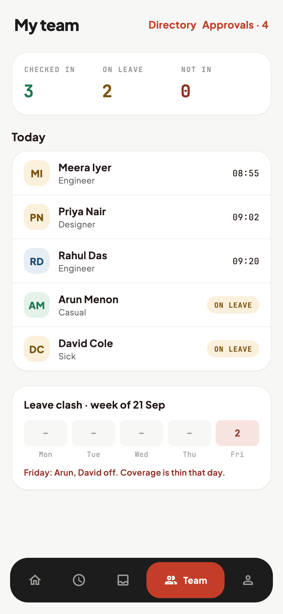<br><sub><b>My team</b></sub></td>
    <td align="center">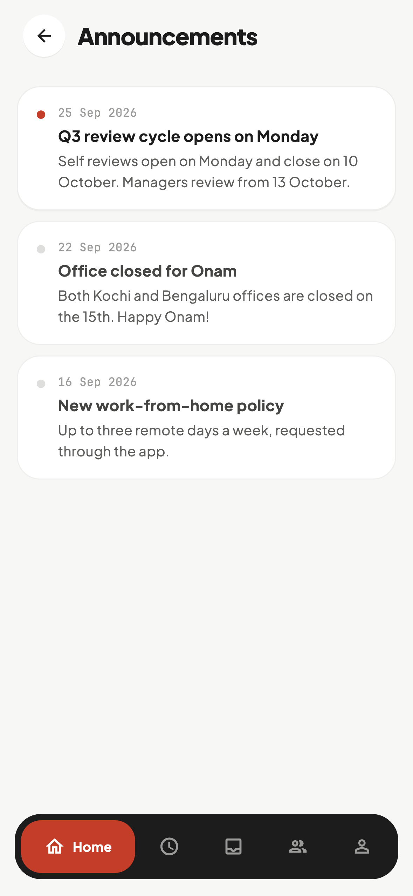<br><sub><b>Announcements</b></sub></td>
    <td align="center">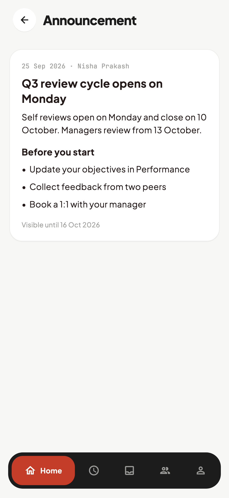<br><sub><b>Announcement</b></sub></td>
  </tr>
  <tr>
    <td align="center">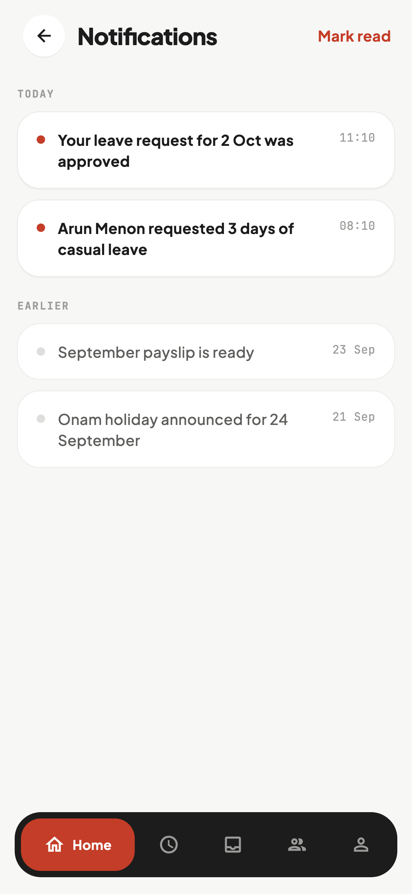<br><sub><b>Notifications</b></sub></td>
    <td align="center">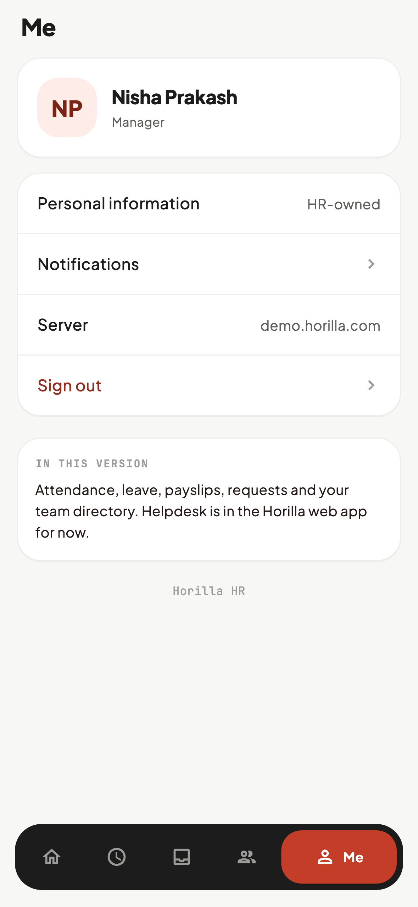<br><sub><b>Me</b></sub></td>
    <td></td>
    <td></td>
  </tr>
</table>

<sub>The screenshots use sample data and are generated from the code. See <a href="#screenshots-are-code">Screenshots are code</a>.</sub>

## Getting started

### Using the app

You need a **Horilla HR 2.0 or later** server. The app signs in with your normal Horilla username and password.

1. Open the app and enter your server's address, for example `hr.yourcompany.com`.
2. Sign in.

`https://` is the default. Plain `http://` is accepted only for private network addresses, such as a server on your office LAN, and the app warns you when a connection isn't encrypted.

### Running from source

Requirements: [Flutter](https://docs.flutter.dev/get-started/install) 3.47 or later, plus Xcode for iOS or Android Studio for Android.

```bash
git clone https://github.com/horilla/horilla-hr-mobile.git
cd horilla-hr-mobile/horilla_mobile
flutter pub get
flutter run
```

Don't have a Horilla server handy? Run the **preview build**. It runs the real app on sample data, with no server or sign-in:

```bash
flutter run -t lib/main_preview.dart
```

## How it's built

| | |
|---|---|
| **State** | [Riverpod](https://riverpod.dev) with plain providers, no code generation |
| **Navigation** | [go_router](https://pub.dev/packages/go_router), where each tab keeps its own stack |
| **Networking** | [dio](https://pub.dev/packages/dio): one client whose interceptors handle token refresh, retries and error mapping |
| **Storage** | Tokens in the Keychain / Keystore via `flutter_secure_storage`, bound to the server that issued them |
| **Design** | A small token-based design system (`lib/core/theme`) and shared widgets; no Material cards or navigation bars |
| **i18n** | Every string goes through `flutter_localizations` (English for now; translations welcome) |

```
horilla_mobile/lib/
├── core/        # API client, auth/session, router, theme tokens
├── shared/      # reusable widgets (cards, buttons, top bar, toasts)
└── features/    # one folder per area; each has data/ (API + models) and ui/
    ├── home/  attendance/  punch/  leave/  requests/  payroll/
    ├── approvals/  team/  announcements/  notifications/
    └── employee/  facedetection/  auth/  shell/
```

The app talks to Horilla's REST API at `/api/v1/`. Parsing is deliberately defensive, because real servers vary: fields go missing, blanks arrive where nulls were expected, and older versions lack some endpoints. Where an endpoint may not exist on an older server, the app falls back instead of failing.

### Checks

```bash
dart format lib test tool
flutter analyze
flutter test
```

CI runs all three on every pull request.

### Screenshots are code

The images above are rendered by a script from the same sample data as the preview build. After a UI change, regenerate them:

```bash
flutter test tool/readme_screenshots.dart   # writes docs/screenshots/*.png
```

## Contributing

Contributions are welcome: bug reports, fixes, translations and new screens.

1. Fork the repo and create a branch from `master`.
2. Make your change, with a test if it touches logic (parsers, API handling, state).
3. Run the three checks above.
4. Open a pull request describing what changed and why.

For larger features, please open an issue first so we can agree on the approach. Server-side changes belong in [horilla/horilla-hr](https://github.com/horilla/horilla-hr).

**Security issues:** please don't open a public issue. Report them through [GitHub security advisories](https://github.com/horilla/horilla-hr-mobile/security/advisories/new).

## The previous app

This is a ground-up rewrite. The original app is preserved at the [`v1-legacy`](https://github.com/horilla/horilla-hr-mobile/tree/v1-legacy) tag.

## License

[LGPL-2.1](LICENSE), the same as Horilla HR.

<div align="center"><sub>Made by the <a href="https://www.horilla.com">Horilla</a> team and contributors.</sub></div>
